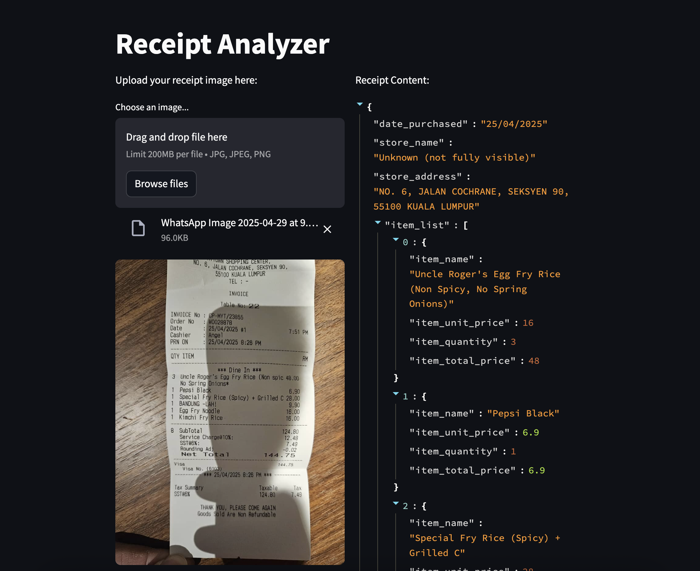

# Resit LLM 
This is a resit OCR using LLM multimodel. The output of the LLM model will be structured
output. 

## Example

## Getting Started
1. Prerequisite: python>=3.10 
2. Install require dependancy: `pip install -r requirements.txt`
4. Set the openai api key in the environment variable `OPENAI_API_KEY`
3. Run the stremlit application using: `streamlit run src/app.py`
